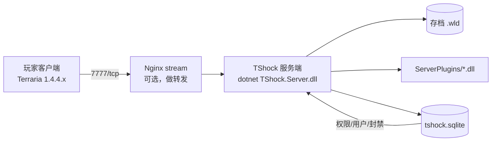

# Terraria TShock 开服笔记

TShock 是 Terraria 的服务端 + 插件框架。这篇记录从零到能玩的全过程。

## 这一组里还有什么

| 分类 | 篇目 |
| --- | --- |
| 开服 | [[server-setup\|从零搭建]] · [[server-config\|配置篇]] · [[tshock5-setup\|TShock 5.0 补充]] · [[raspberry-pi\|树莓派]] · [[centos8-offline-mono\|离线装 mono]] |
| 上手 | [[getting-started\|TShock 上手玩（一）]] · [[chinese-support\|开启中文]] |
| 连载 | [[vol26001-fuzhu-memories\|vol26001 腐竹的回忆]] · [[vol26002-52hz-whale\|vol26002 52赫兹的鲸]] · [[vol26003-mcsmanager\|vol26003 MCSManager]] · [[vol26004-vanilla-server\|vol26004 原版服务器]] |
| 指令 | [[cmd-warp\|/warp 传送点]] · [[cmd-worldinfo\|/worldinfo /worldmode]] · [[cmd-worldevent\|/worldevent 世界事件]] · [[cmd-summon\|/sb /sm 召唤]] |
| 管理 | [[whitelist-and-ban\|白名单与 ban]] · [[backup-and-anticheat\|备份与反作弊]] · [[auto-backup\|自动备份地图]] · [[forced-fresh-start\|强制开荒]] · [[import-save-to-fresh-start\|存档导入强制开荒]] |
| 进阶 | [[journey-mode\|旅行模式浅析]] · [[rest-api\|REST API]] · [[reference\|TShock 参考]] |

插件相关的看 [[plugins/index|TShock 插件]] 那组。

## 整体结构



- `TShock.Server.dll` 是入口，靠 .NET 运行时跑
- `ServerPlugins/` 放插件，丢进去重启即可
- `tshock.sqlite` 存用户、组、封禁记录，**要单独备份**

## 环境准备

TShock 5.x 用 .NET 6+，先装运行时：

```bash
# Debian / Ubuntu
sudo apt update
sudo apt install -y dotnet-runtime-6.0 unzip

dotnet --list-runtimes
```

从 [TShock Releases](https://github.com/Pryaxis/TShock/releases) 下载对应 Terraria 版本的包，解压：

```bash
mkdir -p ~/tshock && cd ~/tshock
unzip ~/TShock-5.2.1-for-Terraria-1.4.4.9-linux-x64.zip
chmod +x TShock.Server
```

## 配置

`config.json` 里几处**必须**改：

| 键 | 默认值 | 改成 | 说明 |
| --- | --- | --- | --- |
| `Settings.ServerPort` | `7777` | 你想要的端口 | 记得防火墙放行 |
| `Settings.MaxSlots` | `8` | 按需 | 超过会挤掉人 |
| `Settings.ServerPassword` | `""` | 设一个 | 空密码 = 谁都能进 |
| `Settings.SecureSocket` | `false` | 外网建议 `true` | 但客户端要支持 |
| `Settings.WorldName` | `world` | 你的存档名 | 不带 `.wld` |

> [!WARNING]
> `ServerPassword` 会明文写在 `config.json` 里。
> 如果你把服务端目录提交到 git（很多人会），密码就泄露了。
> 这个仓库的 `private/` 目录专门放这类内容。

## 首次启动

```bash
cd ~/tshock
./TShock.Server -world ~/tshock/worlds/main.wld -config config.json
```

第一次跑会要求创建世界，按提示选尺寸和难度。启动成功后能看到控制台：

![[terraria-server-console.png|640]]

在游戏里用 `127.0.0.1:7777` 连接，进服后：

```
/register 你的密码
/login 你的密码
```

TShock 的账号和 Terraria 的角色是分开的两套东西，别搞混。

## 用 systemd 托管

手敲命令不是长久之计。`/etc/systemd/system/tshock.service`：

```ini
[Unit]
Description=TShock Terraria Server
After=network.target

[Service]
Type=simple
User=terraria
WorkingDirectory=/home/terraria/tshock
ExecStart=/usr/bin/dotnet /home/terraria/tshock/TShock.Server.dll \
          -config /home/terraria/tshock/config.json \
          -world /home/terraria/tshock/worlds/main.wld \
          -logpath /home/terraria/tshock/logs -logformat json
Restart=on-failure
RestartSec=10

[Install]
WantedBy=multi-user.target
```

```bash
sudo systemctl daemon-reload
sudo systemctl enable --now tshock
sudo journalctl -u tshock -f
```

> [!TIP]
> 服务端不要用 root 跑。建个 `terraria` 用户，`chown` 一下目录，
> 万一插件有漏洞也不至于整台机器沦陷。

## 控制台常用指令

```
/worldinfo              存档信息
/save                   立刻存档（别等自动保存）
/off -s                 安全关服（会先存档）
/user add <名字> <密码> superadmin
/group addperm <组> <权限>
/ban add <名字> <理由>
```

## 插件踩坑

- **版本必须对**：插件编译时针对的 TShock API 版本和你的服务端不一致，加载时会报 `MissingMethodException`
- **`.dll` 直接丢 `ServerPlugins/`**，有些插件还需要配套的 `.json` 配置放同目录
- 插件报错先看日志里的 `Exception`，多数是权限组没配或者依赖的库缺失
- 想看插件到底有没有加载：启动日志里搜 `Loading plugin`

```bash
# 只看插件加载情况
grep -i "plugin" ~/tshock/logs/*.log | tail -30
```

## 备份

要备的东西就三样：`worlds/*.wld`、`tshock.sqlite`、插件配置。

```bash
#!/usr/bin/env bash
set -euo pipefail
SRC="$HOME/tshock"
DST="/backup/tshock/$(date +%F_%H%M)"
mkdir -p "$DST"
cp -a "$SRC"/worlds "$DST"/
cp -a "$SRC"/tshock.sqlite "$DST"/
# 只留最近 14 天
find /backup/tshock -maxdepth 1 -type d -mtime +14 -exec rm -rf {} +
```

丢进 crontab，每天凌晨 4 点跑一次：

```text
0 4 * * * /home/terraria/backup.sh >> /var/log/tshock-backup.log 2>&1
```

## 相关

- [[starbound/docker]] —— 同样是开服，那个走了 Docker 路线
- [[nginx-reverse-proxy]]
