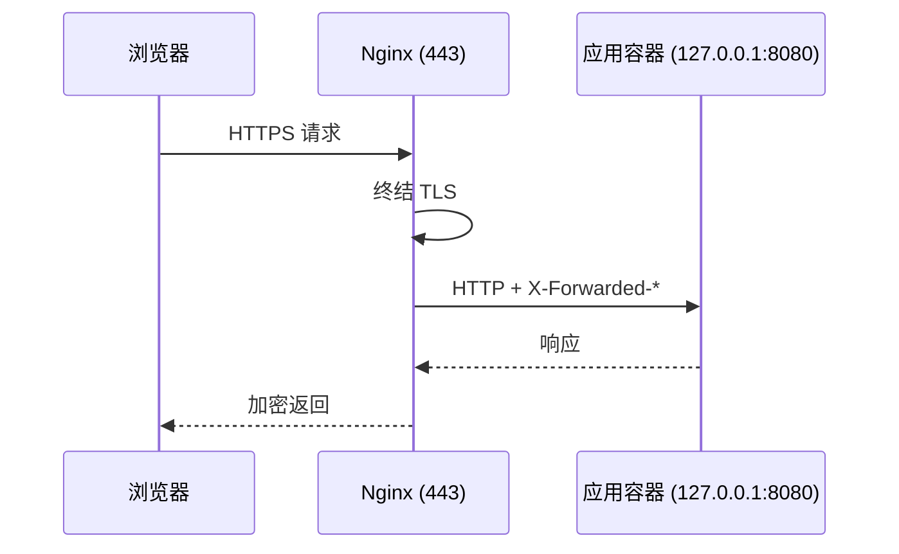

# Nginx 反向代理配置模板

直接能用的模板，附上每一行为什么这么写。

## 请求链路



TLS 在 Nginx 这一层终结，后面的应用只处理明文 HTTP —— 所以应用**必须**监听 `127.0.0.1`，不能监听 `0.0.0.0`，否则别人可以绕过 HTTPS 直接访问。

## 基础模板

```nginx
# /etc/nginx/conf.d/app.conf

upstream app_backend {
    server 127.0.0.1:8080;
    keepalive 32;                  # 复用后端连接，高并发下省掉大量握手
}

server {
    listen 80;
    listen [::]:80;
    server_name example.com;
    return 301 https://$host$request_uri;
}

server {
    listen 443 ssl;
    listen [::]:443 ssl;
    http2 on;
    server_name example.com;

    ssl_certificate     /etc/letsencrypt/live/example.com/fullchain.pem;
    ssl_certificate_key /etc/letsencrypt/live/example.com/privkey.pem;
    ssl_protocols       TLSv1.2 TLSv1.3;
    ssl_prefer_server_ciphers off;

    # 安全响应头
    add_header X-Content-Type-Options nosniff always;
    add_header X-Frame-Options SAMEORIGIN always;
    add_header Referrer-Policy strict-origin-when-cross-origin always;

    client_max_body_size 100m;     # 不设的话上传大文件会 413

    access_log /var/log/nginx/app.access.log;
    error_log  /var/log/nginx/app.error.log warn;

    location / {
        proxy_pass http://app_backend;
        proxy_http_version 1.1;
        proxy_set_header Connection "";          # 配合 upstream keepalive

        # 这三行决定了应用能不能拿到真实客户端信息
        proxy_set_header Host              $host;
        proxy_set_header X-Real-IP         $remote_addr;
        proxy_set_header X-Forwarded-For   $proxy_add_x_forwarded_for;
        proxy_set_header X-Forwarded-Proto $scheme;

        proxy_connect_timeout 5s;
        proxy_read_timeout    60s;
        proxy_send_timeout    60s;
    }
}
```

```bash
sudo nginx -t && sudo systemctl reload nginx
```

> [!TIP]
> 永远先 `nginx -t`。配置写错时 `reload` 会失败但**旧进程还在跑**，
> 你以为生效了其实没有；而 `restart` 会把服务打挂。

## WebSocket 要额外加两行

WebSocket 靠 `Upgrade` 头做协议切换，默认的 `Connection: close` 会把它掐掉：

```nginx
location /ws/ {
    proxy_pass http://127.0.0.1:9001;
    proxy_http_version 1.1;
    proxy_set_header Upgrade    $http_upgrade;
    proxy_set_header Connection "upgrade";
    proxy_set_header Host       $host;
    proxy_read_timeout 7d;        # 长连接别让 Nginx 提前断
}
```

> [!WARNING]
> `proxy_read_timeout` 默认 60 秒。WebSocket 静默超过 60 秒就会被断开，
> 表现是「页面放着不动一会儿就掉线」。要么调大，要么让应用定期发心跳。

## 拿到真实客户端 IP

代理链是 `客户端 -> CDN -> Nginx -> 应用` 时，`X-Forwarded-For` 会是一串：

```
X-Forwarded-For: 203.0.113.7, 198.51.100.23, 192.0.2.1
```

从左到右依次是原始客户端和各级代理。**只有你信任的代理加的那一段才可信**，因为客户端可以自己伪造这个头。

Nginx 侧用 `realip` 模块从可信来源里还原：

```nginx
set_real_ip_from 173.245.48.0/20;   # 只信任 Cloudflare 的网段
set_real_ip_from 103.21.244.0/22;
real_ip_header X-Forwarded-For;
real_ip_recursive on;
```

之后 `$remote_addr` 就是真实客户端 IP，日志里记的也是它。

## 常见状态码速查

| 状态码 | 在这里通常意味着 |
| --- | --- |
| `502 Bad Gateway` | 后端没起来 / 端口写错 / 容器挂了 |
| `504 Gateway Timeout` | 后端活着但处理超时，先看 `proxy_read_timeout` 和后端日志 |
| `413` | `client_max_body_size` 太小 |
| `499` | **客户端**主动断开，通常是用户等不及了；对应后端可能还在跑 |
| `301` 循环 | `X-Forwarded-Proto` 没传，应用误以为自己在 HTTP 上又跳了一次 |

## 相关

- [[disk-full-troubleshooting]] —— Nginx 日志是磁盘大户之一
- [[docker-compose-tips]]
